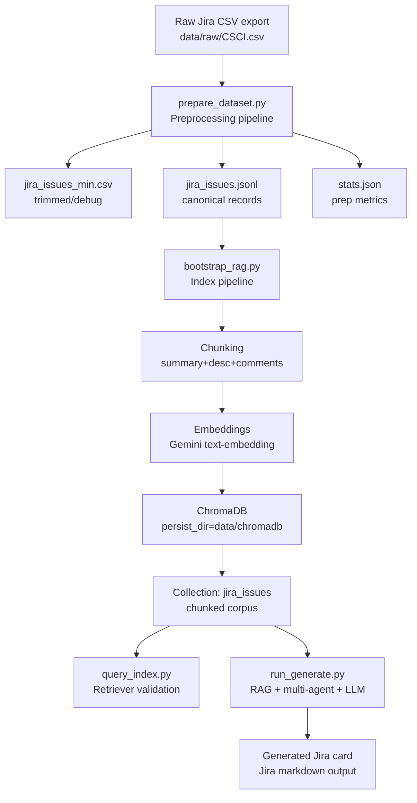
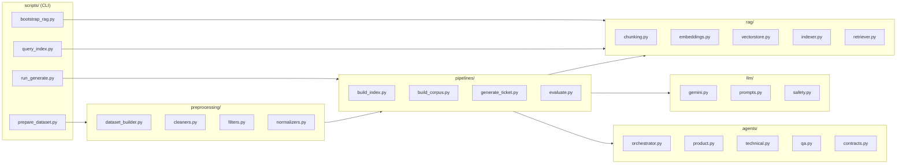

# Jira TicketCreator (RAG + Multi-Agent Jira Card Generator)

A production-style, resume-ready AI engineering project that turns natural-language work requests into well-structured Jira cards using:

- Data preprocessing (CSV to clean dataset)
- RAG indexing (embeddings to ChromaDB vector store)
- Semantic retrieval (query to top-k historical ticket chunks)
- LLM generation (Gemini 2.5 Flash-Lite to formatted Jira markdown)
- Multi-agent refinement loop (Product, Technical, QA agents orchestrated)

This repository is designed to be extensible: CSV today, Jira API ingestion later; Chroma today, other vector stores later; Gemini today, other LLMs later — via stable interfaces and factory patterns.

---

## Table of Contents

- [What has been built so far](#what-has-been-built-so-far)
- [Project Structure](#project-structure)
- [Architecture](#architecture)
  - [End-to-end Flow](#end-to-end-flow)
  - [Component Diagram](#component-diagram)
- [Setup](#setup)
- [Step-by-step: From raw CSV to generated Jira card](#step-by-step-from-raw-csv-to-generated-jira-card)
  - [Step 1 — Prepare dataset](#step-1--prepare-dataset)
  - [Step 2 — Bootstrap RAG index (ChromaDB)](#step-2--bootstrap-rag-index-chromadb)
  - [Step 3 — Validate the index](#step-3--validate-the-index)
  - [Step 4 — Retrieve similar historical tickets](#step-4--retrieve-similar-historical-tickets)
  - [Step 5 — Generate a Jira card (RAG + Agents)](#step-5--generate-a-jira-card-rag--agents)
- [Usage Examples](#usage-examples)
- [Common issues and fixes](#common-issues-and-fixes)
- [Roadmap (Phase 2)](#roadmap-phase-2)

---

## What has been built so far

### 1) Data preparation

- Input: Jira export CSV (wide schema; often 200+ columns)
- Output artifacts:
  - `data/processed/jira_issues.jsonl` (canonical issue records for indexing)
  - `data/processed/jira_issues_min.csv` (trimmed columns for inspection and debugging)
  - `data/processed/stats.json` (pipeline metrics)

### 2) RAG index build

- Chunk issue text (summary, description, acceptance criteria, comments)
- Embed chunks using Gemini embeddings
- Persist vectors and metadata into ChromaDB under a collection (default: `jira_issues`)

### 3) Index validation and querying

- Confirm persisted collection count (example observed: `630` chunks indexed)
- Retrieve top matches for a query with chunk text, metadata, and distance score

### 4) LLM generation

- Generate Jira card output using Gemini 2.5 Flash-Lite Preview
- Updated request format for the Gemini API (roles `user` / `model`, system prompt via `system_instruction`)

### 5) Multi-agent refinement loop

- Agents implemented under `src/jira_formatter/agents/`:
  - `product.py` ensures clarity and business value
  - `technical.py` ensures feasible implementation steps and dependencies
  - `qa.py` ensures acceptance criteria are testable and measurable
  - `orchestrator.py` coordinates refinement and merges feedback
- The generation CLI supports `--no-agents` to compare outputs

---

## Project Structure

Current structure:

```
C:.
├─configs
│ .env.example
│ app.yaml
│ eval.yaml
│ prompts.yaml
├─data
│ ├─chromadb
│ ├─processed
│ │ jira_issues.jsonl
│ │ jira_issues_min.csv
│ │ stats.json
│ └─raw
│ CSCI.csv
├─docs
│ architecture.md
│ data_prep.md
│ evaluation.md
│ rag_design.md
├─scripts
│ bootstrap_rag.py
│ learn_step_by_step.py
│ prepare_dataset.py
│ run_eval.py
│ run_generate.py
│ test_system.py
├─src
│ └─jira_formatter
│ ├─agents
│ ├─core
│ ├─ingestion
│ ├─llm
│ ├─pipelines
│ ├─preprocessing
│ └─rag
└─tests
├─fixtures
├─integration
└─unit
```

Design principles:

- `scripts/` contains thin CLI entrypoints.
- `src/jira_formatter/` contains reusable library code and abstractions.
- `tests/` contains unit and integration tests.
- `configs/` contains configuration templates and prompt definitions.
- `data/` contains raw inputs, processed artifacts, and vector DB persistence.

---

## Architecture

### End-to-end Flow





## Setup

### Requirements

- Python 3.12+
- `uv` for dependency management

### Install dependencies

Run from the repository root (the folder containing `pyproject.toml`):

```
uv sync
```

### Set Gemini API key (PowerShell)

```
$env:GOOGLE_API_KEY="YOUR_KEY"
```

Verify:

```
echo $env:GOOGLE_API_KEY
```

------

## Step-by-step: From raw CSV to generated Jira card

### Step 1 — Prepare dataset

Purpose:

- Convert a wide Jira CSV export into canonical records used for indexing and retrieval.

Command:

```
uv run python .\Jira_TicketCreator\scripts\prepare_dataset.py --input ".\Jira_TicketCreator\data\raw\CSCI.csv"
```

Outputs:

- `data/processed/jira_issues.jsonl`: one issue per line (structured fields + canonical text)
- `data/processed/jira_issues_min.csv`: trimmed view of the dataset (debugging and validation)
- `data/processed/stats.json`: stats describing the input and output shapes

High-level pipeline:

1. Load CSV
2. Select required columns (issue key, type, status, priority, summary, description, comments, etc.)
3. Normalize text fields (trim whitespace, handle missing values)
4. Build a unified “document text” per issue
5. Write JSONL, trimmed CSV, and stats

------

### Step 2 — Bootstrap RAG index (ChromaDB)

Purpose:

- Chunk and embed the issue corpus, then persist to a vector database for retrieval.

Command:

```
uv run python .\Jira_TicketCreator\scripts\bootstrap_rag.py `
  --input-kind jsonl `
  --input ".\Jira_TicketCreator\data\processed\jira_issues.jsonl" `
  --persist-dir ".\data\chromadb" `
  --collection "jira_issues"
```

Expected logs (example observed):

- `Indexing complete: {'issues_indexed': 518, 'chunks_indexed': 630}`

High-level pipeline:

1. Read issues from JSONL
2. Chunk each issue’s canonical text
3. Embed each chunk with Gemini embeddings
4. Store embeddings, chunk text, and metadata in ChromaDB
5. Persist the collection to disk at `persist-dir`

------

### Step 3 — Validate the index

Purpose:

- Confirm that the persisted ChromaDB collection contains vectors and documents.

Validation signals:

- `Count: 630` indicates 630 chunk records exist in the collection.
- Peek results show populated `ids`, `documents`, and `metadatas`.

Interpretation:

- Chunk IDs often look like: `CSCI-770::chunk=0::<hash>` to ensure uniqueness.
- `documents[]` contains the embedded chunk text.
- `metadatas[]` contains structured fields such as `issue_key`, `status`, `priority`, and `chunk_index`.

Operational note:

- If you query with a different `--persist-dir` than you indexed, you will see a count of `0` (a different empty database path).

------

### Step 4 — Retrieve similar historical tickets

Purpose:

- Find the most semantically similar historical ticket chunks to a query.

Command:

```
uv run python .\Jira_TicketCreator\scripts\query_index.py `
  --persist-dir ".\data\chromadb" `
  --collection "jira_issues" `
  --query "Create a run capacity report to show actual load vs capacity"
```

Interpretation:

- Each “Match N” is a historical ticket chunk closest to the request.
- `distance` is the similarity measure returned by the vector store (smaller values typically indicate higher similarity).
- Retrieved chunks are used as context for the generation prompt.

------

### Step 5 — Generate a Jira card (RAG + Agents)

Purpose:

- Generate a Jira card using RAG context plus optional multi-agent refinement.

Command:

```
uv run python .\Jira_TicketCreator\scripts\run_generate.py `
  --persist-dir ".\data\chromadb" `
  --collection "jira_issues" `
  --top-k 6 `
  --model "gemini-2.5-flash-lite-preview-09-2025" `
  --query "Create a card to configure DevOps pipeline with Snowflake in edp-etl-atilda-legacy repo"
```

High-level pipeline:

1. Retrieval: embed query and fetch top-k chunks from ChromaDB
2. Draft: build prompt from system rules, user request, and retrieved context
3. Generate: Gemini drafts Jira markdown output
4. Refine: product/technical/QA agents critique and improve
5. Finalize: orchestrator merges feedback into a final Jira card

Flags:

- `--no-rag` disables retrieval augmentation (pure generation).
- `--no-agents` disables multi-agent refinement (single-pass generation).

------

## Usage Examples

### Example 1 — Full pipeline from scratch

```
$env:GOOGLE_API_KEY="YOUR_KEY"

uv run python .\Jira_TicketCreator\scripts\prepare_dataset.py --input ".\Jira_TicketCreator\data\raw\CSCI.csv"

uv run python .\Jira_TicketCreator\scripts\bootstrap_rag.py `
  --input-kind jsonl `
  --input ".\Jira_TicketCreator\data\processed\jira_issues.jsonl" `
  --persist-dir ".\data\chromadb" `
  --collection "jira_issues"

uv run python .\Jira_TicketCreator\scripts\query_index.py `
  --persist-dir ".\data\chromadb" `
  --collection "jira_issues" `
  --query "Create a run capacity report to show actual load vs capacity"

uv run python .\Jira_TicketCreator\scripts\run_generate.py `
  --persist-dir ".\data\chromadb" `
  --collection "jira_issues" `
  --top-k 6 `
  --model "gemini-2.5-flash-lite-preview-09-2025" `
  --query "Create a card to configure DevOps pipeline with Snowflake in edp-etl-atilda-legacy repo"
```

### Example 2 — Compare with and without agents

```
# With agents
uv run python .\Jira_TicketCreator\scripts\run_generate.py `
  --persist-dir ".\data\chromadb" `
  --collection "jira_issues" `
  --model "gemini-2.5-flash-lite-preview-09-2025" `
  --query "Create a card to configure DevOps pipeline with Snowflake in edp-etl-atilda-legacy repo"

# Without agents
uv run python .\Jira_TicketCreator\scripts\run_generate.py `
  --persist-dir ".\data\chromadb" `
  --collection "jira_issues" `
  --no-agents `
  --model "gemini-2.5-flash-lite-preview-09-2025" `
  --query "Create a card to configure DevOps pipeline with Snowflake in edp-etl-atilda-legacy repo"
```

### Example 3 — Disable RAG (pure generation)

```
uv run python .\Jira_TicketCreator\scripts\run_generate.py `
  --no-rag `
  --model "gemini-2.5-flash-lite-preview-09-2025" `
  --query "Create a run capacity report to show actual load vs capacity"
```

------

## Common issues and fixes

### ModuleNotFoundError: No module named 'jira_formatter'

Likely causes:

- Running from the wrong directory (not the repository root containing `pyproject.toml`)
- Package path misconfiguration

Recommended checks:

- Run commands from the repo root
- Ensure `pyproject.toml` includes correct setuptools configuration:
  - `package-dir = {"" = "Jira_TicketCreator/src"}`
  - `include = ["jira_formatter*"]`

### GOOGLE_API_KEY is required

Cause:

- The environment variable is not set in the current shell session.

Fix (PowerShell):

```
$env:GOOGLE_API_KEY="YOUR_KEY"
```

### Collection count is 0 after indexing

Cause:

- Using a different `--persist-dir` when querying or generating than when indexing.

Fix:

- Keep `--persist-dir` consistent across bootstrap, query, and generate steps.

### Gemini role errors (invalid role: system)

Cause:

- Gemini API expects roles `user` and `model`. System prompts must be passed via `system_instruction`.

Fix:

- Update the LLM client wrapper to send system instructions using the supported SDK field.

------

## Roadmap (Phase 2)

Planned improvements to strengthen AI engineering portfolio quality:

1. Migrate embeddings to `google.genai`
   - Remove deprecated `google.generativeai` usage
   - Use a single modern SDK for both embeddings and generation
2. Jira API ingestion
   - Implement `jira_api_source.py` to ingest issues directly
   - Use a factory method to swap input kinds (`csv`, `jsonl`, `jira_api`)
3. Evaluation harness
   - Add `run_eval.py` scoring:
     - format compliance
     - acceptance criteria completeness and testability
     - agent contribution deltas (with vs without agents)
4. Stronger output validation
   - Schema validation for generated output
   - Deterministic prompt templates
   - Guardrails for unsafe content or secrets leakage
5. CI and test coverage
   - Golden tests for output format compliance
   - Integration tests with mocked LLM responses
   - Static type checks and linting gates